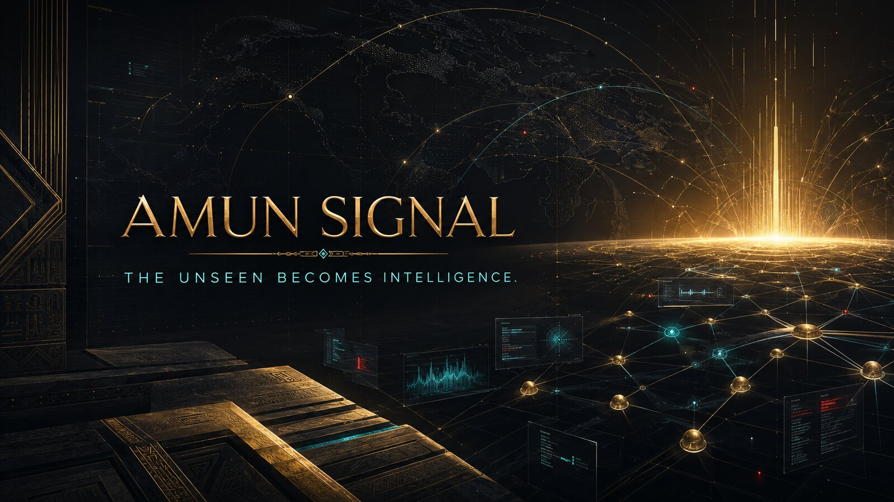
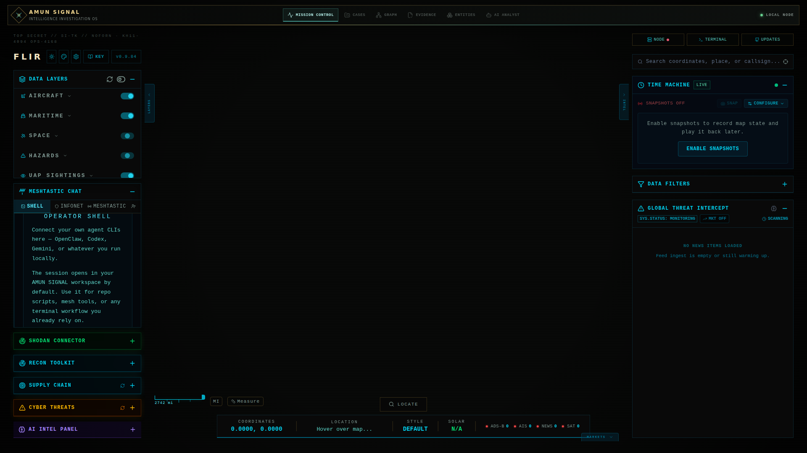
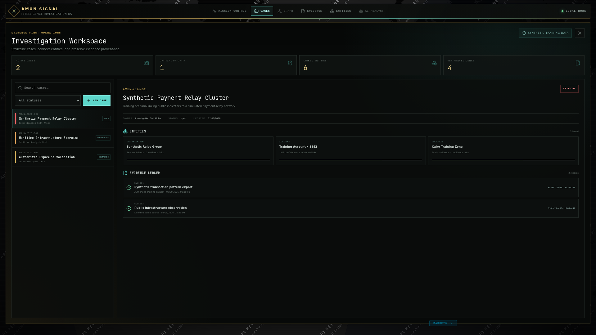

[Launch the live AMUN SIGNAL interface](https://eldoctorams.github.io/Amun-Signal/)

<p align="center">
  <h1 align="center">AMUN SIGNAL</h1>
  <p align="center"><strong>The unseen becomes intelligence.</strong></p>
  <p align="center">Evidence-first, AI-assisted Intelligence Investigation OS</p>
</p>





<p align="center">
  <a href="./LICENSE"></a>
  <a href="./docs/AMUN_PRODUCT_ROADMAP.md"></a>
  
</p>

## Intelligence has a new signal

**AMUN SIGNAL** transforms fragmented public-source telemetry into structured, defensible intelligence. It combines a global geospatial mission view with durable investigations, entity intelligence, auditable evidence provenance, knowledge graphs, and an AI co-analyst designed to cite evidence instead of inventing certainty.

> The world is overflowing with signals. AMUN SIGNAL reveals which ones matter, connects what appears unrelated, preserves why every conclusion was reached, and turns the unseen into intelligence an investigator can defend.

## Mission capabilities

- **Mission Control** — a unified operational view for multi-domain public signals.
- **Cases** — durable investigations with status, priority, ownership, and timeline.
- **Entities** — people, organizations, infrastructure, assets, accounts, and identifiers.
- **Graph Intelligence** — relationships, paths, clusters, and contextual connections.
- **Evidence Ledger** — canonical hashing, provenance, timestamps, and confidence.
- **AI Analyst** — evidence-aware assistance with traceable conclusions.
- **Geospatial Intelligence** — aircraft, maritime, space, hazards, cyber, and infrastructure layers.
- **Time Machine** — capture and replay operational map state.
- **Local-first operation** — operator-controlled deployment and data handling.

## Investigation model



The integrated workspace turns public signals into governed case records. Investigators can search and filter cases, connect entities with explicit confidence, preserve source provenance, and review the evidence ledger without leaving Mission Control. The included scenarios are clearly marked synthetic training data; newly created cases remain local until a governed backend is configured.

| Primitive | Purpose |
|---|---|
| Case | The investigation container and decision history |
| Entity | A person, organization, asset, account, location, or identifier |
| Relationship | A typed, directional connection between entities |
| Evidence Record | An immutable analytical artifact with integrity metadata |
| Source Provenance | Where information came from, when it was collected, and how reliable it is |

## Technology

- Next.js and TypeScript
- MapLibre GL
- FastAPI and Python
- Rust privacy primitives
- Docker and GitHub Actions
- SHA-256 evidence integrity

## Quick start

### Docker

```bash
git clone https://github.com/eldoctorams/Amun-Signal.git
cd Amun-Signal
docker compose pull
docker compose up -d
```

Open `http://localhost:3000`.

### Development

```bash
git clone https://github.com/eldoctorams/Amun-Signal.git
cd Amun-Signal

cd backend
python -m venv venv
source venv/bin/activate
pip install -e .

cd ../frontend
npm ci
npm run dev
```

## Product direction

1. **Foundation** — identity, design system, domain model, evidence integrity, and migration safety.
2. **Investigation Workspace** — operational cases, entities, relationships, and evidence workflows.
3. **Graph Intelligence** — link analysis, pathfinding, entity resolution, and community discovery.
4. **AI Analyst** — grounded reasoning, citations, confidence, and investigative assistance.
5. **Operational Scale** — connectors, collaboration, observability, governance, and releases.

Read the [product roadmap](./docs/AMUN_PRODUCT_ROADMAP.md) and [architecture](./docs/AMUN_ARCHITECTURE.md).

## Security and responsible use

AMUN SIGNAL is designed for lawful research, analysis, defensive security, fraud investigation, and authorized intelligence workflows. Operators are responsible for complying with applicable laws, provider terms, privacy obligations, and organizational governance.

- Public-source data does not automatically mean unrestricted use.
- Confidence and provenance must accompany analytical conclusions.
- Sensitive connectors remain operator-controlled.
- Secrets must never be committed to the repository.
- Active techniques require explicit authorization.

## Contributing

Contributions should preserve the evidence-first architecture, pass automated tests, avoid unverified claims, and document security or privacy implications. Start with [AGENTS.md](./AGENTS.md) and the architecture notes.

## License and attribution

AMUN SIGNAL is distributed under the GNU Affero General Public License v3.0. Required licensing, attribution, and data-source notices are maintained in [LICENSE](./LICENSE), [NOTICE.md](./NOTICE.md), and [DATA-ATTRIBUTION.md](./DATA-ATTRIBUTION.md).

---

<p align="center">
  <strong>AMUN SIGNAL</strong><br>
  The unseen becomes intelligence.<br><br>
  Created and led by <a href="https://drahmedelsayed.com/">Dr. Ahmed Mohamed El Sayed</a>
</p>
